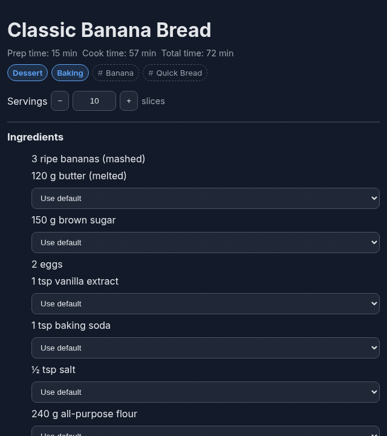

# Lockstack Recipe

Recipe cards, serving scaling, and a focused cooking mode — built directly
into your Logseq graph.



## What it does

Lockstack Recipe turns a normal Logseq DB graph into a recipe manager.
Recipes stay readable, editable Logseq pages — the plugin adds deterministic
ingredient parsing, live serving scaling, measurement conversion, a recipe
browser, cover images, and a focused Cooking Mode on top, without ever
becoming a second source of truth. If you disable or uninstall the plugin,
your recipes remain ordinary, readable Logseq content.

## Highlights

- **Beautiful recipe cards inside Logseq** — ingredients, steps, notes, and a
  cover image, rendered from a plain Logseq outline.
- **Change servings and watch ingredients scale** — the `−`/`+` controls or a
  direct yield input recalculate every quantity from its canonical parsed
  amount, and scaling back to the original yield restores it exactly.
- **A focused Cooking Mode** — one step at a time, with duration/temperature
  annotations and keyboard navigation.
- **Structured, queryable, DB-native recipe data** — no second database, no
  cloud account, no visible property clutter in your outline.
- **Clear, deterministic ingredient parsing** — English, Turkish, French,
  German, and Spanish, with exact, range, approximate, and qualitative
  amounts. Nothing is ever invented: unparseable amounts stay as your
  original text.
- **Works entirely inside your graph, fully offline** — no AI service, API
  key, account, or telemetry required.

## Installation

### Logseq Marketplace

Open **Settings → Marketplace** in Logseq, search for **Lockstack Recipe**,
and install it from there.

### Manual installation

Download the plugin ZIP from the
[latest release](https://github.com/frogiraffe/lockstack-recipe/releases/latest),
extract it, then in Logseq: **Settings → Plugins → Load unpacked plugin** and
select the extracted folder (the one containing `package.json`, `logo.svg`,
and `dist/` — not `dist/` alone).

## Quick start

Run **`Lockstack Recipe: Create Recipe`** from the command palette. It
creates a clean, editable Logseq page skeleton — title, yield, Ingredients,
Steps, and Notes — and attaches the recipe's metadata itself. From there,
just edit the page like any other Logseq content; Lockstack Recipe picks up
the changes automatically.

Already have recipe content in Logseq (your own notes, or something pasted
in)? Select the root block and run **`Lockstack Recipe: Convert to Recipe`**.
A preview shows exactly what was recognized, and any ambiguous ingredient
line lets you keep it as written or supply the interpretation yourself — the
plugin never fabricates a value.

A minimal recipe looks like this:

```text
Chunky Chocolate Chip Cookies
  Yield: 12 cookies
  Prep: 15 min
  Cook: 10-12 min

  Ingredients
    120 g butter
    150 g brown sugar
    1 egg
    180 g dark chocolate (roughly chopped)

  Steps
    Melt the butter and let it cool slightly.
    Mix in the sugar, then the egg, then fold in the chocolate.
    Bake at 180°C for 10-12 minutes.

  Notes
    Centers may still look soft when removed from the oven — that's fine.
```

## Recipe format

Localized section headings are supported (Ingredients/Malzemeler,
Steps/Yapılış, Notes/Notlar, and the French/German/Spanish equivalents).
Ingredient lines follow `<amount> <unit> <ingredient> (optional note)` —
ranges (`2-3 tbsp`), fractions (`1/2`, `½`), and qualitative amounts
(`biraz`, `to taste`) are all valid, and servings scale from whichever form
you write.

The full authoring contract, including the exact grammar the parser
understands, is documented in
[`docs/recipe-format.md`](docs/recipe-format.md).

## Example recipe

A ready-to-paste example is in
[`examples/banana-bread.md`](examples/banana-bread.md) — paste its outline
into a Logseq page and run **Convert to Recipe** on it to see the full flow.

## Converting a recipe from the web

Lockstack Recipe doesn't scrape websites — instead, use any AI assistant as a
one-time conversion step: paste the recipe text and the prompt from
[`docs/recipe-format.md`](docs/recipe-format.md) into your assistant of
choice, then paste its output into a Logseq page and run **Convert to
Recipe**.

## Compatibility

Lockstack Recipe targets Logseq **DB graphs only** — file graphs are not
supported, by design. If a required Logseq capability isn't available, the
plugin's commands and UI stay inactive rather than behaving unpredictably.

## Development

```bash
pnpm install
pnpm check     # typecheck + lint + test + production build
pnpm package   # build the release ZIP
pnpm run package:verify
```

## License

[MIT](LICENSE)
