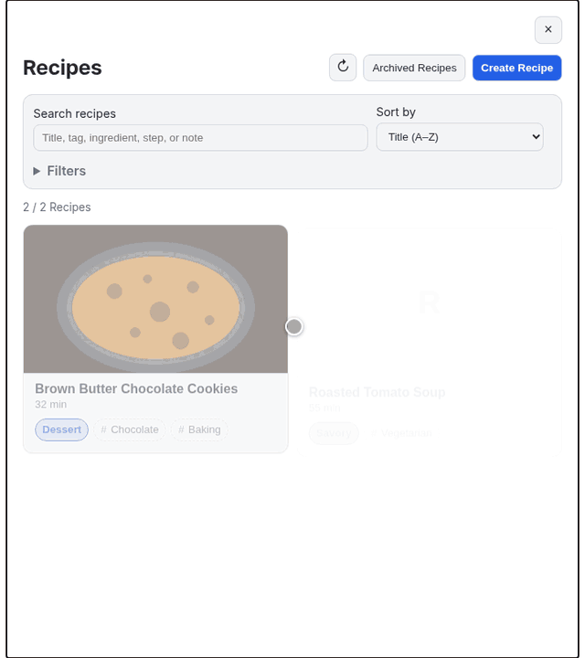

# Logseq Recipe

Turn a Logseq DB graph into a local recipe manager and kitchen companion,
without moving recipes out of Logseq.



## What you get

- **Recipes stay plain Logseq blocks.** New recipes live under one
  `Recipe Library` page; existing recipe pages keep working unchanged.
- **Create or convert.** Start blank, or turn an outline you already have
  into a recipe with a preview of every change.
- **Cooking Mode** with timers that keep running when you leave it, step
  notes, photos and audio, scaled ingredients, and resume-where-you-left-off.
- **Serving scaling and unit conversion** (metric, US Customary, Imperial)
  that never rewrites the quantities you wrote.
- **Search across everything** — titles, tags, ingredients, steps, notes —
  in a card grid with cover photos.
- **Five languages** for both the interface and recipe parsing: English,
  Turkish, French, German, and Spanish.
- **Local and deterministic**: no account, cloud service, AI, or telemetry.

Unknown or ambiguous text stays unchanged. Logseq Recipe never invents a
quantity, density, duration, or temperature.

## Requirements

Logseq Recipe supports **Logseq DB graphs only**. It checks the Logseq APIs it
needs at runtime and shows a warning instead of writing when the current build
is incompatible.

## Install

In Logseq, open **Plugins → Marketplace**, search for **Logseq Recipe**, and
select **Install**.

For a manual install, download the ZIP from the
[latest GitHub release](https://github.com/frogiraffe/logseq-recipe/releases/latest),
extract it, choose **Plugins → Load unpacked plugin**, and select the extracted
folder containing `package.json`.

## Create or convert a recipe

Run **Logseq Recipe: Create Recipe** from the command palette for a blank
recipe, or select an existing outline and run **Logseq Recipe: Convert to
Recipe**. Convert previews every change and asks you to resolve ambiguous
sections or ingredients before it writes anything.

A recipe remains a plain outline:

```text
Chocolate Chip Cookies
  Yield: 12 cookies
  Prep: 15 min
  Cook: 10-12 min
  Ingredients
    120 g butter
    150 g brown sugar
    1 egg
    180 g dark chocolate (roughly chopped)
  Steps
    Melt the butter and let it cool slightly.
      Stop before it browns.
      
    Mix in the sugar and egg.
    Bake at 180°C for 10-12 minutes.
  Notes
    The centers may still look soft when removed from the oven.
```

Blocks nested under a step are that step's notes; a block that is just an
image or audio file from the graph's `assets` folder is shown as a photo or
player. See [the banana bread example](examples/banana-bread.md) for a complete
outline you can paste into Logseq.

## Browse and edit

- Open **Logseq Recipe: Recipes** to search, filter, sort, and open recipes.
  Every word you type in the search box must appear somewhere in the recipe.
- On a recipe, **Start cooking** and **Edit recipe** are up front; duplicate,
  settings, **Open in Logseq**, and archive are under **More actions** (⋯).
- In the editor, drag the handle to reorder ingredients, steps, notes, and
  step notes — with a mouse, touch, or the keyboard (focus the handle, press
  Space, use the arrow keys, Space to drop, Escape to cancel). Nothing is
  written until you save, and a save that Logseq interrupts is reported as
  incomplete rather than silently half-done.
- **Archive** hides a recipe from the list but keeps it indefinitely.
  **Archived Recipes** can restore it, or delete it permanently after a
  confirmation.
- Recipe Settings hold categories, tags, recipe language, measurement
  systems, custom conversions, and the cover image.

Edits made directly in Logseq refresh the open plugin view. Removing the
plugin leaves your recipe content intact.

## Cook

- **Start cooking** walks through one step at a time; tap the step track to
  jump. The ingredient panel lets you tick items off and change servings.
- **Timers**: a step's duration offers a timer button (ranges offer both
  ends; "about 20 minutes" offers `~20:00`), and **+ Timer** starts one of any
  length. Timers can run side by side and be paused. They keep running when
  you leave Cooking Mode or close the plugin, and ring with a sound and a
  Logseq notice; a small dock shows them on every other screen.
- **Exit for now** keeps your step, ticked ingredients, and timers for the
  rest of the Logseq session; **Finish cooking** clears them.
- The screen stays awake while Cooking Mode is open.

## Covers and media

Covers and step media reference files already in the graph's `assets`
folder; the plugin never uploads, moves, or deletes files. External links,
absolute paths, and paths outside `assets` are refused, and missing files show
a placeholder.

## Languages

Choose the interface language in the plugin settings. Recipe text is read in
the recipe's language, and each line falls back to whichever supported
language understands it — a Turkish step is still understood when Logseq runs
in English.

## Limits

- File graphs are not supported.
- Parsing is deterministic syntax recognition, not general natural-language
  understanding. Ambiguous lines stay as written until you correct them.
- Website import, nutrition, shopping lists, meal planning, and cloud sync are
  not included.

If commands are missing, confirm the plugin is enabled and the current graph is
a DB graph. For bugs, open an
[issue](https://github.com/frogiraffe/logseq-recipe/issues) with your Logseq
version, graph type, and the relevant DevTools console error.

## Development

Requires Node.js 20.19+ and pnpm 10.33.0.

```bash
pnpm install --frozen-lockfile
pnpm check                # typecheck, lint, test, build
pnpm package              # logseq-recipe-v<version>.zip
pnpm run package:verify
pnpm demo                 # the real UI over sample data, in a browser
```

Pushing a `v<version>` tag builds, verifies, and publishes the release ZIP
through GitHub Actions.

## License

[MIT](LICENSE)
