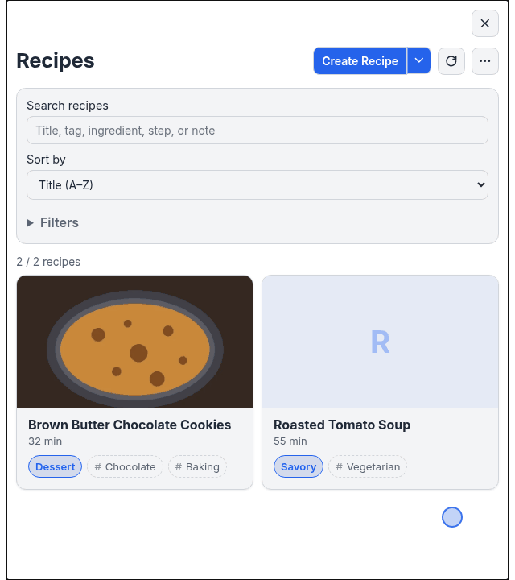

# Logseq Recipe

Recipe cards, serving scaling, unit conversion and a hands-free Cooking Mode
for Logseq DB graphs. Your recipes stay ordinary Logseq blocks.



- **Create, import or convert.** Start blank, paste a recipe as text, or turn
  an outline you already wrote into a recipe. Every conversion is previewed
  before anything is written.
- **Scale and convert** servings and units (metric, US, imperial) without
  ever rewriting the amounts you wrote.
- **Cook** one step at a time, with timers that keep running when you leave,
  and your place kept until you finish.
- **Logseq-native.** Categories, tags, servings and times are Logseq
  properties, so Logseq's own queries find your recipes:
  `{{query (property recipe_categories [[Dessert]])}}`.
- **Local and deterministic.** No account, cloud or AI. Text the parser
  can't read with certainty stays exactly as written.
- English, Turkish, French, German and Spanish, for the interface and for
  reading recipes.

## Install

Logseq Recipe needs a **Logseq DB graph**. In Logseq, open **Plugins →
Marketplace**, search for **Logseq Recipe** and select **Install**.

To install by hand, download the ZIP from the
[latest release](https://github.com/frogiraffe/logseq-recipe/releases/latest),
extract it, and choose **Plugins → Load unpacked plugin** on the extracted
folder.

## Start

Open the command palette and run:

| Command | What it does |
| --- | --- |
| **Logseq Recipe: Recipes** | Browse, search and open your recipes |
| **Logseq Recipe: Create Recipe** | Start a blank recipe |
| **Logseq Recipe: Import Recipe from Text** | Paste a whole recipe |
| **Logseq Recipe: Convert to Recipe** | Turn the current outline into a recipe (also in a block's context menu) |

A recipe is a plain outline:

```text
Chocolate Chip Cookies
  Yield: 12 cookies
  Prep: 15 min
  Cook: 12 min
  Ingredients
    120 g butter
    150 g brown sugar
    1 egg
  Steps
    Melt the butter and let it cool slightly.
    Bake at 180°C for 10-12 minutes.
  Notes
    The centers still look soft when they come out.
```

## Documentation

- [Getting started](docs/getting-started.md): install, your first recipe,
  the outline format
- [Using Logseq Recipe](docs/usage.md): browsing, editing, scaling, Cooking
  Mode, covers, languages
- [Properties and queries](docs/properties-and-queries.md): what the plugin
  stores on your blocks, and how to query it
- [Upgrading to 1.5](docs/migration.md): what changes, what to do, and going
  back to 1.4.1
- [Parser guarantees](docs/parser.md): what is read, and what is never
  guessed
- [Data model](docs/data-model.md) and [architecture](docs/architecture.md):
  how recipes are stored and why
- [Contributing](docs/contributing.md): building, testing and the live
  Logseq tests

## Limits

File graphs are not supported. Website import, nutrition, shopping lists,
meal planning and sync are not part of the plugin. Parsing recognizes
recipe syntax; it is not general language understanding.

If commands are missing, check that the plugin is enabled and the graph is a
DB graph. For bugs, open an
[issue](https://github.com/frogiraffe/logseq-recipe/issues) with your Logseq
version and the DevTools console error.

## License

[MIT](LICENSE)
